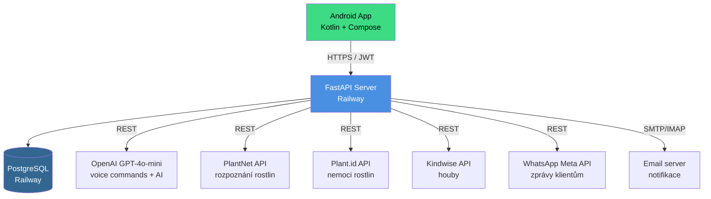
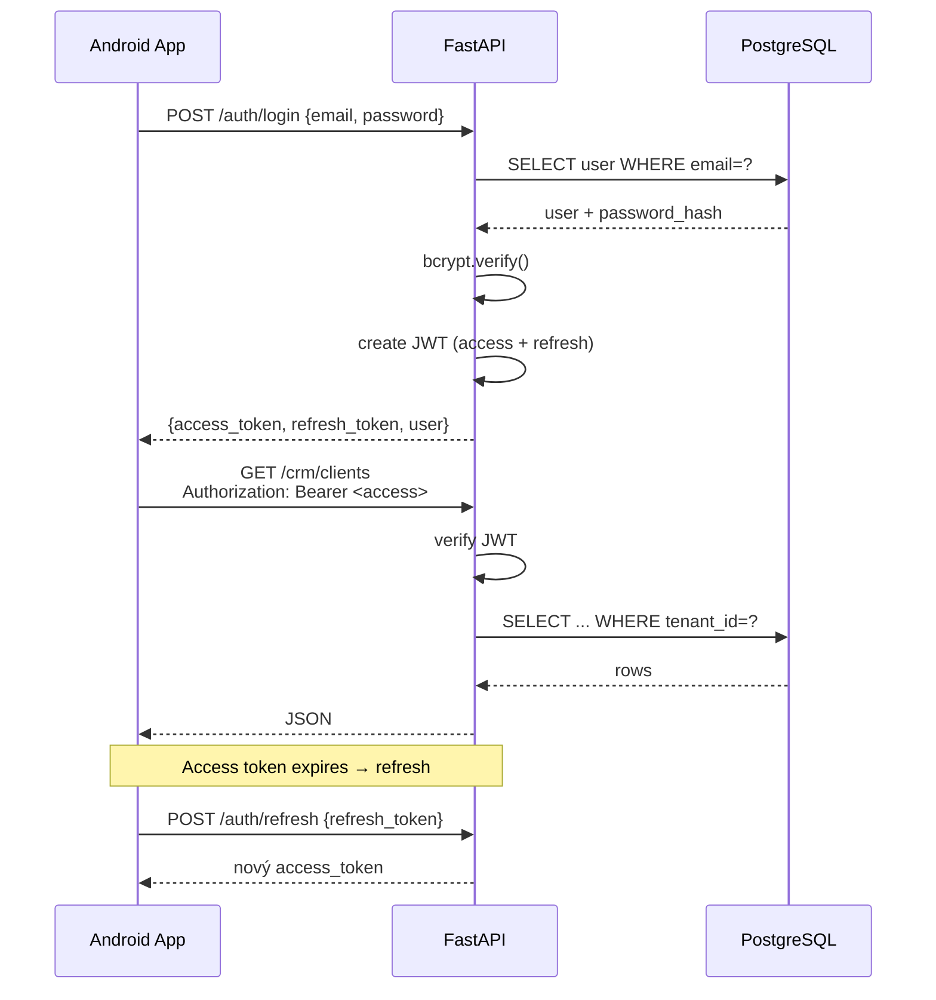
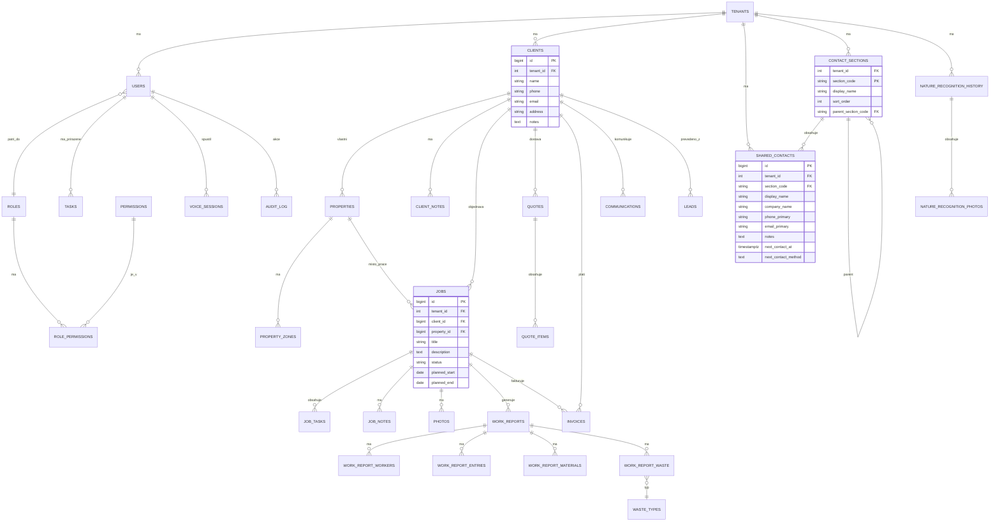
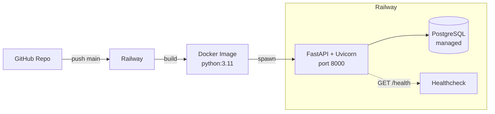
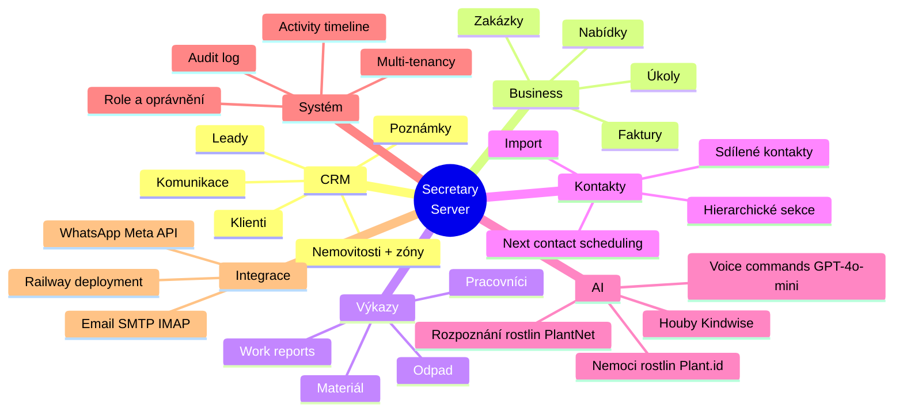

# Secretary Server – Mapa systému

FastAPI backend pro Secretary CRM (terénní servisní firmy, zahradnictví). Nasazeno na Railway, PostgreSQL databáze.

---

## 1. Systémová architektura



---

## 2. Auth flow



Role-based permissions: `users.role_id → roles → role_permissions → permissions`. Multi-tenant přes `tenant_id` na všech tabulkách.

---

## 3. API endpointy

### Skupiny endpointů

```mermaid
graph LR
    R[/ root /]
    R --> A[/auth/*]
    R --> C[/crm/*]
    R --> W[/work-reports/*]
    R --> P[/plants/*]
    R --> M[/mushrooms/*]
    R --> N[/nature/*]
    R --> V[/voice/*]
    R --> AD[/admin/*]
    R --> T[/tenant/*]
    R --> O[/onboarding/*]
    R --> H[/health]

    C --> C1[clients]
    C --> C2[properties]
    C --> C3[jobs]
    C --> C4[tasks]
    C --> C5[leads]
    C --> C6[quotes]
    C --> C7[invoices]
    C --> C8[communications]
    C --> C9[contacts]
```

### Kompletní reference

| Skupina | Endpoint | Popis |
|---------|----------|-------|
| **Auth** | `POST /auth/login` | Přihlášení, vrací JWT páry |
| | `POST /auth/refresh` | Obnova access tokenu |
| | `POST /auth/register` | Registrace (admin only) |
| **Clients** | `GET /crm/clients` | Seznam klientů tenantu |
| | `POST /crm/clients` | Vytvořit klienta |
| | `GET /crm/clients/{id}` | Detail + notes + service-rates |
| | `PUT /crm/clients/{id}` | Aktualizovat |
| | `DELETE /crm/clients/{id}` | Smazat |
| | `POST /crm/clients/{id}/notes` | Přidat poznámku |
| | `GET /crm/clients/{id}/service-rates` | Individuální sazby |
| | `POST /crm/clients/sync-contacts` | Synchronizace s Android kontakty |
| **Properties** | `GET /crm/properties` | Seznam nemovitostí |
| | `POST /crm/properties` | Vytvořit |
| | `GET /crm/properties/{id}` | Detail + zones |
| | `PUT /crm/properties/{id}` | Aktualizovat |
| | `DELETE /crm/properties/{id}` | Smazat |
| **Jobs** | `GET /crm/jobs` | Seznam zakázek |
| | `POST /crm/jobs` | Vytvořit zakázku |
| | `GET /crm/jobs/{id}` | Detail + tasks + notes |
| | `PUT /crm/jobs/{id}` | Aktualizovat |
| | `POST /crm/jobs/{id}/photos` | Nahrát foto |
| | `POST /crm/jobs/{id}/notes` | Přidat poznámku |
| | `GET /crm/jobs/{id}/audit` | Audit log |
| **Tasks** | `GET /crm/tasks` | Seznam úkolů |
| | `POST /crm/tasks` | Vytvořit |
| | `PUT /crm/tasks/{id}` | Aktualizovat status |
| | `DELETE /crm/tasks/{id}` | Smazat |
| **Leads** | `GET /crm/leads` | Seznam potenciálních klientů |
| | `POST /crm/leads` | Vytvořit lead |
| | `PUT /crm/leads/{id}` | Aktualizovat |
| | `POST /crm/leads/{id}/convert-to-client` | Převést na klienta |
| **Quotes** | `GET /crm/quotes` | Seznam nabídek |
| | `POST /crm/quotes` | Vytvořit nabídku |
| | `GET /crm/quotes/{id}` | Detail + items |
| | `PUT /crm/quotes/{id}` | Aktualizovat |
| | `POST /crm/quotes/{id}/items` | Přidat položku |
| **Invoices** | `GET /crm/invoices` | Seznam faktur |
| | `POST /crm/invoices` | Vytvořit |
| | `PUT /crm/invoices/{id}` | Aktualizovat status |
| **Communications** | `GET /crm/communications` | Log komunikace |
| | `POST /crm/communications` | Zaznamenat komunikaci |
| **Contacts** | `GET /crm/contacts` | Sdílené kontakty (včetně `next_contact_at`) |
| | `POST /crm/contacts` | Vytvořit |
| | `PUT /crm/contacts/{id}` | Aktualizovat (sekce, next_contact) |
| | `DELETE /crm/contacts/{id}` | Smazat |
| | `GET /crm/contacts/sections` | Sekce (s hierarchií `parent_section_code`) |
| | `POST /crm/contacts/import` | Import z telefonu |
| **Work Reports** | `GET /work-reports` | Seznam výkazů |
| | `POST /work-reports` | Vytvořit |
| | `GET /work-reports/{id}` | Detail + workers + entries + materials + waste |
| | `POST /work-reports/{id}/workers` | Přidat pracovníka |
| | `POST /work-reports/{id}/entries` | Přidat výkaz práce |
| | `POST /work-reports/{id}/materials` | Přidat materiál |
| | `POST /work-reports/{id}/waste` | Přidat odpad |
| **Plants** | `POST /plants/identify` | Rozpoznání rostliny (PlantNet) |
| | `POST /plants/health-assessment` | Zdraví rostliny (Plant.id) |
| **Mushrooms** | `POST /mushrooms/identify` | Rozpoznání houby (Kindwise) |
| **Nature** | `GET /nature/history` | Historie rozpoznání |
| **Voice** | `POST /voice/sessions` | Start voice session |
| | `POST /voice/sessions/{id}/transcribe` | STT audio → text |
| | `POST /voice/sessions/{id}/command` | Zpracování příkazu (GPT) |
| | `DELETE /voice/sessions/{id}` | Ukončit session |
| **Admin** | `GET /admin/audit-log` | Audit log |
| | `GET /admin/activity` | Aktivita uživatelů |
| **Tenant** | `GET /tenant/config` | Konfigurace tenantu |
| | `PUT /tenant/config` | Aktualizovat |
| | `GET /tenant/default-rates` | Defaultní sazby |
| **Onboarding** | `POST /onboarding/start` | Start onboarding flow |
| | `POST /onboarding/complete` | Dokončit |
| **Health** | `GET /health` | Liveness probe (Railway) |

---

## 4. Datový model – ER diagram



### Přehled tabulek

| Kategorie | Tabulky |
|-----------|---------|
| **Auth** | `users`, `roles`, `permissions`, `role_permissions` |
| **Tenancy** | `tenants`, `tenant_default_rates`, `tenant_config` |
| **CRM** | `clients`, `client_notes`, `properties`, `property_zones`, `leads`, `communications` |
| **Business** | `quotes`, `quote_items`, `jobs`, `job_tasks`, `job_notes` |
| **Finance** | `invoices`, `pricing_rules` |
| **Operations** | `tasks`, `work_reports`, `work_report_workers`, `work_report_entries`, `work_report_materials`, `work_report_waste`, `waste_loads`, `waste_types` |
| **Voice** | `voice_sessions` |
| **Contacts** | `contact_sections`, `shared_contacts`, `user_contact_sync` |
| **Nature AI** | `nature_recognition_history`, `nature_recognition_photos` |
| **System** | `audit_log`, `activity_timeline`, `photos` |

---

## 5. Deployment



- **Runtime**: Python 3.11, FastAPI + Uvicorn
- **DB migrace**: `EXTRA_TABLES_SQL` v `main.py` – `CREATE TABLE IF NOT EXISTS` + `ALTER TABLE ADD COLUMN IF NOT EXISTS` na startu
- **Env vars**: `DATABASE_URL`, `JWT_SECRET`, `OPENAI_API_KEY`, `PLANTNET_API_KEY`, `PLANT_ID_API_KEY`, `KINDWISE_API_KEY`, `WHATSAPP_TOKEN`
- **Health check**: `GET /health` – Railway liveness probe

---

## 6. Feature mapa – backend


